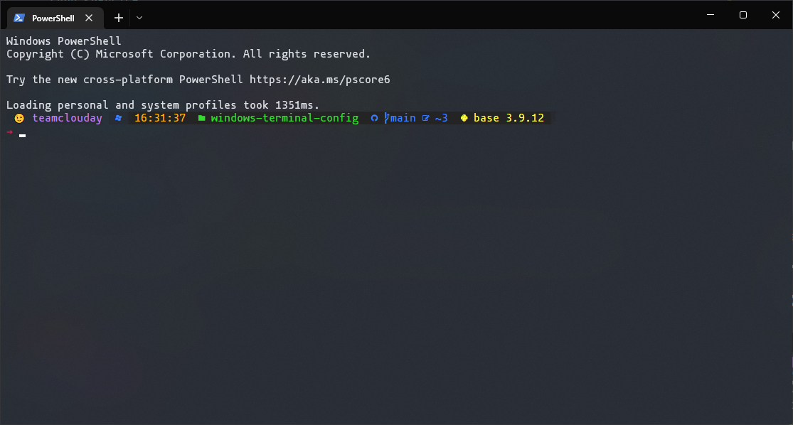

# windows-terminal-config

My personal windows terminal config file

Copy & paste content from `settings.json` to Windows Terminal profile

------

## Powershell Configuration

Detailed information can be found here: [Setup Tutorial](https://ohmyposh.dev/docs/installation/windows)

Steps:
1. Go to [Nerd Fonts Website](https://www.nerdfonts.com/font-downloads) and download `Mononoki Nerd Font`, and install them system wise
2. Run Commands to install `oh-my-posh`
   ```powershell
   Set-ExecutionPolicy Bypass -Scope Process -Force; Invoke-Expression ((New-Object System.Net.WebClient).DownloadString('https://ohmyposh.dev/install.ps1'))
   ```
3. Copy `oh-my-posh` theme to user home folder
   ```powershell
   cp .oh-my-posh.omp.json ~/
   ```
4. Configure `oh-my-posh`
   ```powershell
   notepad $PROFILE
   ```  
   Or if you have [vscode](https://code.visualstudio.com/) installed, the last command can be:
   ```powershell
   code $PROFILE
   ```
5. In notepad(or vscode), add the following lines  
   ```powershell
   oh-my-posh init pwsh --config "~/.oh-my-posh.omp.json" | Invoke-Expression

   Set-PSReadLineOption -Colors @{Operator="Gray"}
   Set-PSReadLineOption -Colors @{Parameter="Magenta"}
   ```

May also need to modify powershell execution policy:  
```powershell
Set-ExecutionPolicy RemoteSigned
```

Can also set vscode font to `mononoki NF`, so that the inside terminal can correctly display the characters  

------

## Demo  


